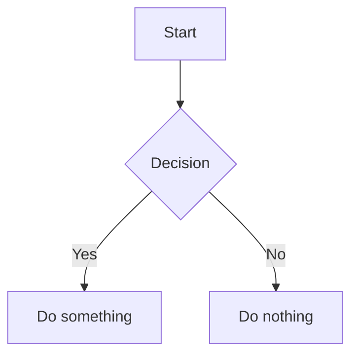

# vscode-mdv 実装計画

> **For agentic workers:** REQUIRED SUB-SKILL: Use superpowers:subagent-driven-development (recommended) or superpowers:executing-plans to implement this plan task-by-task. Steps use checkbox (`- [ ]`) syntax for tracking.

**Goal:** VSCode の `.md` ファイルをリッチなプレビューで表示する Custom Editor 拡張を作る

**Architecture:** Custom Editor API (readonly) で `.md` のデフォルトエディタを置き換え、mdv から移植した unified/remark/rehype パイプラインで HTML を生成し Webview に表示する。Mermaid は Webview 内でクライアントサイドレンダリング。

**Tech Stack:** TypeScript, VSCode Extension API, unified/remark/rehype, Shiki, KaTeX, Mermaid, esbuild

---

## ファイル構成

| ファイル | 役割 |
|---------|------|
| `src/extension.ts` | エントリポイント。エディタプロバイダ・コマンド・ファイルウォッチャーの登録 |
| `src/mdvEditorProvider.ts` | `CustomReadonlyEditorProvider` 実装。Webview 生成・更新 |
| `src/markdown/processor.ts` | unified パイプライン（mdv から移植、Tauri 依存除去） |
| `src/markdown/remarkFrontmatterExtract.ts` | カスタム remark プラグイン（mdv からそのまま移植） |
| `src/markdown/rehypeFrontmatterTable.ts` | カスタム rehype プラグイン（mdv からそのまま移植） |
| `src/markdown/rehypeImagePath.ts` | カスタム rehype プラグイン（Webview URI 用に書き直し） |
| `src/commands.ts` | `mdv.toggleEditor` コマンド実装 |
| `media/preview.css` | プレビュースタイル（mdv ライトモードから移植、素の CSS） |
| `media/preview.js` | Webview 内スクリプト（Mermaid 初期化・レンダリング、メッセージ受信） |
| `package.json` | 拡張マニフェスト |
| `tsconfig.json` | TypeScript 設定 |
| `.vscodeignore` | パッケージ除外設定 |
| `esbuild.mjs` | ビルドスクリプト（静的アセットのコピー含む） |
| `.vscode/launch.json` | デバッグ起動設定 |
| `.vscode/tasks.json` | ビルドタスク設定 |

---

### Task 1: プロジェクト初期化

**Files:**
- Create: `package.json`
- Create: `tsconfig.json`
- Create: `.vscodeignore`
- Create: `esbuild.mjs`
- Create: `src/extension.ts`（空のactivate/deactivate）

- [ ] **Step 1: `package.json` を作成**

```json
{
  "name": "vscode-mdv",
  "displayName": "mdv - Markdown Viewer",
  "description": "Rich Markdown preview with GFM, syntax highlighting, math, and diagrams",
  "version": "0.0.1",
  "private": true,
  "engines": { "vscode": "^1.96.0" },
  "categories": ["Other"],
  "main": "./out/extension.js",
  "activationEvents": [],
  "contributes": {
    "customEditors": [
      {
        "viewType": "mdv.preview",
        "displayName": "mdv Preview",
        "selector": [{ "filenamePattern": "*.md" }],
        "priority": "default"
      }
    ],
    "commands": [
      {
        "command": "mdv.toggleEditor",
        "title": "mdv: Toggle Preview / Text Editor"
      }
    ],
    "keybindings": [
      {
        "command": "mdv.toggleEditor",
        "key": "ctrl+shift+v",
        "when": "activeCustomEditorId == 'mdv.preview' || resourceExtname == '.md'"
      }
    ]
  },
  "scripts": {
    "build": "node esbuild.mjs",
    "watch": "node esbuild.mjs --watch",
    "package": "vsce package"
  },
  "devDependencies": {
    "@types/vscode": "^1.96.0",
    "@types/node": "^22.0.0",
    "esbuild": "^0.25.0",
    "typescript": "^5.9.0"
  },
  "dependencies": {
    "unified": "^11.0.5",
    "remark-parse": "^11.0.0",
    "remark-frontmatter": "^5.0.0",
    "remark-gfm": "^4.0.1",
    "remark-breaks": "^4.0.0",
    "remark-math": "^6.0.0",
    "remark-supersub": "^1.0.0",
    "remark-deflist": "^1.0.0",
    "@flowershow/remark-wiki-link": "^3.3.1",
    "remark-rehype": "^11.1.2",
    "rehype-katex": "^7.0.1",
    "rehype-stringify": "^10.0.1",
    "shiki": "^3.20.0",
    "@shikijs/rehype": "^3.20.0",
    "katex": "^0.16.27",
    "mermaid": "^11.12.2",
    "yaml": "^2.8.2",
    "unist-util-visit": "^5.0.0"
  }
}
```

- [ ] **Step 2: `tsconfig.json` を作成**

```json
{
  "compilerOptions": {
    "module": "Node16",
    "target": "ES2022",
    "lib": ["ES2022"],
    "outDir": "out",
    "rootDir": "src",
    "sourceMap": true,
    "strict": true,
    "esModuleInterop": true,
    "skipLibCheck": true,
    "resolveJsonModule": true,
    "declaration": true,
    "moduleResolution": "Node16"
  },
  "include": ["src/**/*.ts"],
  "exclude": ["node_modules", "out"]
}
```

- [ ] **Step 3: `esbuild.mjs` を作成**

```javascript
import * as esbuild from "esbuild";
import { cpSync, mkdirSync } from "fs";

const isWatch = process.argv.includes("--watch");

// Copy static assets (KaTeX CSS/fonts, Mermaid JS) to media/
function copyAssets() {
  mkdirSync("media/katex", { recursive: true });
  cpSync("node_modules/katex/dist/katex.min.css", "media/katex/katex.min.css");
  cpSync("node_modules/katex/dist/fonts", "media/katex/fonts", { recursive: true });
  cpSync("node_modules/mermaid/dist/mermaid.min.js", "media/mermaid.min.js");
}

/** @type {esbuild.BuildOptions} */
const buildOptions = {
  entryPoints: ["src/extension.ts"],
  bundle: true,
  outfile: "out/extension.js",
  external: ["vscode"],
  format: "cjs",
  platform: "node",
  sourcemap: true,
  target: "node22",
};

copyAssets();

if (isWatch) {
  const ctx = await esbuild.context(buildOptions);
  await ctx.watch();
  console.log("Watching for changes...");
} else {
  await esbuild.build(buildOptions);
  console.log("Build complete.");
}
```

- [ ] **Step 4: `.vscodeignore` を作成**

```
src/**
node_modules/**
.vscode/**
tsconfig.json
esbuild.mjs
docs/**
media/katex/fonts/.gitkeep
```

注意: `media/` フォルダはビルド時に KaTeX CSS/フォントと Mermaid JS がコピーされるため、パッケージに含める必要がある。`node_modules/**` は除外されるが `media/` は含まれる。

- [ ] **Step 5: `src/extension.ts` を空のエントリポイントで作成**

```typescript
import * as vscode from "vscode";

export function activate(context: vscode.ExtensionContext) {
  // TODO: register editor provider and commands
}

export function deactivate() {}
```

- [ ] **Step 6: 依存パッケージをインストールしてビルド確認**

Run: `cd C:\WORK\vscode-mdv && npm install && npm run build`
Expected: `Build complete.` が表示され `out/extension.js` が生成される

- [ ] **Step 7: コミット**

```bash
git init
git add -A
git commit -m "chore: initialize vscode-mdv extension project"
```

---

### Task 2: カスタム remark/rehype プラグインを移植

**Files:**
- Create: `src/markdown/remarkFrontmatterExtract.ts`（mdv からそのまま移植）
- Create: `src/markdown/rehypeFrontmatterTable.ts`（mdv からそのまま移植）
- Create: `src/markdown/rehypeImagePath.ts`（Webview URI 用に書き直し）

- [ ] **Step 1: `src/markdown/remarkFrontmatterExtract.ts` を作成**

mdv の `src/lib/markdown/remarkFrontmatterExtract.ts` をそのまま移植（変更なし）:

```typescript
import type { Root, Yaml } from "mdast";
import type { VFile } from "vfile";

/**
 * Remark plugin to extract frontmatter data and store it in vfile.data.
 * This allows the frontmatter to be accessed by rehype plugins later.
 */
export function remarkFrontmatterExtract() {
  return (tree: Root, file: VFile) => {
    const yamlNode = tree.children.find(
      (node): node is Yaml => node.type === "yaml"
    );

    if (yamlNode && yamlNode.value) {
      file.data.frontmatterRaw = yamlNode.value;
    }
  };
}
```

- [ ] **Step 2: `src/markdown/rehypeFrontmatterTable.ts` を作成**

mdv の `src/lib/markdown/rehypeFrontmatterTable.ts` をそのまま移植（変更なし）:

```typescript
import type { Root, Element, ElementContent } from "hast";
import type { VFile } from "vfile";
import { parse as parseYaml } from "yaml";

export function rehypeFrontmatterTable() {
  return (tree: Root, file: VFile) => {
    const frontmatterRaw = file.data.frontmatterRaw as string | undefined;

    if (!frontmatterRaw) {
      return;
    }

    let parsed: Record<string, unknown>;
    try {
      parsed = parseYaml(frontmatterRaw);
    } catch {
      const errorElement = createErrorElement(frontmatterRaw);
      tree.children.unshift(errorElement);
      return;
    }

    if (!parsed || typeof parsed !== "object") {
      return;
    }

    const tableElement = createTableElement(parsed);
    tree.children.unshift(tableElement);
  };
}

function createErrorElement(rawYaml: string): Element {
  return {
    type: "element",
    tagName: "div",
    properties: { className: ["frontmatter-error"] },
    children: [
      {
        type: "element",
        tagName: "div",
        properties: { className: ["frontmatter-error-title"] },
        children: [{ type: "text", value: "Invalid YAML frontmatter" }],
      },
      {
        type: "element",
        tagName: "pre",
        properties: { className: ["frontmatter-error-content"] },
        children: [{ type: "text", value: rawYaml }],
      },
    ],
  };
}

function createTableElement(data: Record<string, unknown>): Element {
  const rows: Element[] = Object.entries(data).map(([key, value]) => {
    return {
      type: "element",
      tagName: "tr",
      properties: {},
      children: [
        {
          type: "element",
          tagName: "th",
          properties: { scope: "row" },
          children: [{ type: "text", value: key }],
        },
        {
          type: "element",
          tagName: "td",
          properties: {},
          children: formatValue(value),
        },
      ],
    };
  });

  return {
    type: "element",
    tagName: "table",
    properties: { className: ["frontmatter-table"] },
    children: [
      {
        type: "element",
        tagName: "tbody",
        properties: {},
        children: rows,
      },
    ],
  };
}

function formatValue(value: unknown): ElementContent[] {
  if (value === null || value === undefined) {
    return [
      {
        type: "element",
        tagName: "span",
        properties: { className: ["frontmatter-null"] },
        children: [{ type: "text", value: "null" }],
      },
    ];
  }

  if (Array.isArray(value)) {
    const items = value.map((item) => formatPrimitive(item));
    return [{ type: "text", value: items.join(", ") }];
  }

  if (typeof value === "object") {
    return [
      {
        type: "element",
        tagName: "code",
        properties: { className: ["frontmatter-json"] },
        children: [{ type: "text", value: JSON.stringify(value, null, 2) }],
      },
    ];
  }

  return [{ type: "text", value: formatPrimitive(value) }];
}

function formatPrimitive(value: unknown): string {
  if (value === null || value === undefined) {
    return "null";
  }
  if (typeof value === "boolean") {
    return value ? "true" : "false";
  }
  return String(value);
}
```

- [ ] **Step 3: `src/markdown/rehypeImagePath.ts` を作成**

mdv の `rehypeImagePath.ts` をベースに、`convertFileSrc` コールバックを受け取る方式を維持。VSCode 拡張側で `webview.asWebviewUri()` を渡す:

```typescript
import type { Root, Element } from "hast";
import { visit } from "unist-util-visit";

export interface RehypeImagePathOptions {
  /** Absolute path to the Markdown file being processed */
  basePath?: string;
  /** Absolute path to the root folder */
  rootPath?: string;
  /** Function to convert absolute file path to displayable URL */
  convertFileSrc?: (path: string) => string;
}

function isExternalUrl(src: string): boolean {
  return /^(https?:|data:|blob:|asset:|\/\/)/i.test(src);
}

function isRootRelative(src: string): boolean {
  return src.startsWith("/") && !src.startsWith("//");
}

function normalizePath(path: string): string {
  return path.replace(/\\/g, "/");
}

function getDirectory(filePath: string): string {
  const normalized = normalizePath(filePath);
  const lastSlash = normalized.lastIndexOf("/");
  return lastSlash >= 0 ? normalized.substring(0, lastSlash) : "";
}

function resolvePath(relativePath: string, baseDir: string): string {
  const normalized = normalizePath(relativePath);
  const base = normalizePath(baseDir);

  let path = normalized;
  if (path.startsWith("./")) {
    path = path.substring(2);
  }

  const baseSegments = base.split("/").filter((s) => s);
  const pathSegments = path.split("/").filter((s) => s);

  const result = [...baseSegments];
  for (const segment of pathSegments) {
    if (segment === "..") {
      result.pop();
    } else if (segment !== ".") {
      result.push(segment);
    }
  }

  return result.join("/");
}

export function rehypeImagePath(options: RehypeImagePathOptions = {}) {
  const { basePath, rootPath, convertFileSrc } = options;

  return (tree: Root) => {
    if (!basePath) {
      return;
    }

    const baseDir = getDirectory(basePath);

    visit(tree, "element", (node: Element) => {
      if (node.tagName !== "img") {
        return;
      }

      const src = node.properties?.src;
      if (typeof src !== "string" || !src) {
        return;
      }

      if (isExternalUrl(src)) {
        return;
      }

      let absolutePath: string;

      if (isRootRelative(src)) {
        if (rootPath) {
          absolutePath = normalizePath(rootPath) + src;
        } else {
          return;
        }
      } else {
        absolutePath = resolvePath(src, baseDir);
      }

      node.properties = node.properties || {};
      node.properties["dataOriginalPath"] = absolutePath;

      if (convertFileSrc) {
        node.properties.src = convertFileSrc(absolutePath);
      } else {
        node.properties.src = absolutePath;
      }
    });
  };
}
```

- [ ] **Step 4: ビルド確認**

Run: `cd C:\WORK\vscode-mdv && npm run build`
Expected: エラーなくビルド成功

- [ ] **Step 5: コミット**

```bash
git add src/markdown/
git commit -m "feat: port custom remark/rehype plugins from mdv"
```

---

### Task 3: Markdown プロセッサを移植

**Files:**
- Create: `src/markdown/processor.ts`

- [ ] **Step 1: `src/markdown/processor.ts` を作成**

mdv の `processor.ts` をベースに、Tauri 依存を除去し、ライトテーマ単一に簡略化:

```typescript
import { unified } from "unified";
import remarkParse from "remark-parse";
import remarkFrontmatter from "remark-frontmatter";
import remarkWikiLink from "@flowershow/remark-wiki-link";
import remarkGfm from "remark-gfm";
import remarkMath from "remark-math";
import remarkBreaks from "remark-breaks";
import remarkSupersub from "remark-supersub";
import remarkDeflist from "remark-deflist";
import remarkRehype from "remark-rehype";
import rehypeKatex from "rehype-katex";
import rehypeStringify from "rehype-stringify";
import { createHighlighterCore } from "shiki/core";
import { createJavaScriptRegexEngine } from "shiki/engine/javascript";
import rehypeShikiFromHighlighter from "@shikijs/rehype/core";
import { remarkFrontmatterExtract } from "./remarkFrontmatterExtract";
import { rehypeFrontmatterTable } from "./rehypeFrontmatterTable";
import { rehypeImagePath } from "./rehypeImagePath";

// Theme (light only)
import githubLight from "shiki/themes/github-light.mjs";

// Languages (fine-grained bundle)
import javascript from "shiki/langs/javascript.mjs";
import typescript from "shiki/langs/typescript.mjs";
import python from "shiki/langs/python.mjs";
import rust from "shiki/langs/rust.mjs";
import go from "shiki/langs/go.mjs";
import java from "shiki/langs/java.mjs";
import c from "shiki/langs/c.mjs";
import cpp from "shiki/langs/cpp.mjs";
import html from "shiki/langs/html.mjs";
import css from "shiki/langs/css.mjs";
import json from "shiki/langs/json.mjs";
import yaml from "shiki/langs/yaml.mjs";
import toml from "shiki/langs/toml.mjs";
import sql from "shiki/langs/sql.mjs";
import markdown from "shiki/langs/markdown.mjs";
import shellscript from "shiki/langs/shellscript.mjs";
import svelte from "shiki/langs/svelte.mjs";
import mermaid from "shiki/langs/mermaid.mjs";

export type ProcessResult =
  | { ok: true; html: string }
  | { ok: false; error: string };

export interface ProcessOptions {
  /** Absolute path to the Markdown file being processed */
  basePath?: string;
  /** Absolute path to the root folder (workspace root) */
  rootPath?: string;
  /** Function to convert absolute file path to Webview URI */
  convertFileSrc?: (path: string) => string;
}

let highlighterPromise: ReturnType<typeof createHighlighterCore> | null = null;

async function getHighlighter() {
  if (!highlighterPromise) {
    highlighterPromise = createHighlighterCore({
      themes: [githubLight],
      langs: [
        javascript, typescript, python, rust, go, java, c, cpp,
        html, css, json, yaml, toml, sql, markdown, shellscript,
        svelte, mermaid,
      ],
      engine: createJavaScriptRegexEngine(),
    });
  }
  return highlighterPromise;
}

export async function processMarkdown(
  markdownContent: string,
  options: ProcessOptions = {}
): Promise<ProcessResult> {
  try {
    const highlighter = await getHighlighter();

    // eslint-disable-next-line @typescript-eslint/no-explicit-any
    const remarkPlugins: any[] = [
      remarkParse,
      remarkFrontmatter,
      remarkFrontmatterExtract,
      [
        remarkWikiLink,
        {
          format: "regular",
          urlResolver: ({
            filePath,
            heading,
            isEmbed,
          }: {
            filePath: string;
            isEmbed: boolean;
            heading: string;
          }) => {
            if (isEmbed) {
              return filePath;
            }
            const path = filePath.endsWith(".md") ? filePath : `${filePath}.md`;
            return heading ? `${path}#${heading}` : path;
          },
          className: "wiki-link",
          aliasDivider: "|",
        },
      ],
      remarkGfm,
      remarkBreaks,
      remarkSupersub,
      remarkDeflist,
      remarkMath,
    ];

    let processor = unified();
    for (const plugin of remarkPlugins) {
      if (Array.isArray(plugin)) {
        processor = processor.use(plugin[0], plugin[1]);
      } else {
        processor = processor.use(plugin);
      }
    }

    const result = await processor
      .use(remarkRehype, { allowDangerousHtml: true })
      .use(rehypeFrontmatterTable)
      .use(rehypeImagePath, {
        basePath: options.basePath,
        rootPath: options.rootPath,
        convertFileSrc: options.convertFileSrc,
      })
      .use(rehypeKatex)
      .use(rehypeShikiFromHighlighter, highlighter as any, {
        theme: "github-light",
        addLanguageClass: true,
      })
      .use(rehypeStringify, { allowDangerousHtml: true })
      .process(markdownContent);

    return { ok: true, html: String(result) };
  } catch (err) {
    const message =
      err instanceof Error ? err.message : "Unknown error processing markdown";
    return { ok: false, error: message };
  }
}
```

- [ ] **Step 2: ビルド確認**

Run: `cd C:\WORK\vscode-mdv && npm run build`
Expected: エラーなくビルド成功

- [ ] **Step 3: コミット**

```bash
git add src/markdown/processor.ts
git commit -m "feat: port markdown processing pipeline from mdv (light theme only)"
```

---

### Task 4: Custom Editor プロバイダを実装

**Files:**
- Create: `src/mdvEditorProvider.ts`
- Modify: `src/extension.ts`

- [ ] **Step 1: `src/mdvEditorProvider.ts` を作成**

```typescript
import * as vscode from "vscode";
import { processMarkdown } from "./markdown/processor";

export class MdvEditorProvider implements vscode.CustomReadonlyEditorProvider {
  public static readonly viewType = "mdv.preview";

  private readonly webviews = new Map<string, vscode.WebviewPanel>();

  constructor(private readonly context: vscode.ExtensionContext) {}

  async openCustomDocument(
    uri: vscode.Uri,
    _openContext: vscode.CustomDocumentOpenContext,
    _token: vscode.CancellationToken
  ): Promise<vscode.CustomDocument> {
    return { uri, dispose: () => {} };
  }

  async resolveCustomEditor(
    document: vscode.CustomDocument,
    webviewPanel: vscode.WebviewPanel,
    _token: vscode.CancellationToken
  ): Promise<void> {
    const uri = document.uri;
    this.webviews.set(uri.toString(), webviewPanel);

    webviewPanel.webview.options = {
      enableScripts: true,
      localResourceRoots: [
        vscode.Uri.joinPath(this.context.extensionUri, "media"),
        ...(vscode.workspace.workspaceFolders?.map((f) => f.uri) ?? []),
      ],
    };

    webviewPanel.onDidDispose(() => {
      this.webviews.delete(uri.toString());
    });

    await this.updateWebview(webviewPanel, uri);
  }

  public async refresh(uri: vscode.Uri): Promise<void> {
    const panel = this.webviews.get(uri.toString());
    if (panel) {
      await this.updateWebview(panel, uri);
    }
  }

  public hasWebview(uri: vscode.Uri): boolean {
    return this.webviews.has(uri.toString());
  }

  private async updateWebview(
    panel: vscode.WebviewPanel,
    uri: vscode.Uri
  ): Promise<void> {
    const content = await vscode.workspace.fs.readFile(uri);
    const markdownText = Buffer.from(content).toString("utf-8");

    const workspaceFolder = vscode.workspace.getWorkspaceFolder(uri);
    const convertFileSrc = (absolutePath: string) => {
      const fileUri = vscode.Uri.file(absolutePath);
      return panel.webview.asWebviewUri(fileUri).toString();
    };

    const result = await processMarkdown(markdownText, {
      basePath: uri.fsPath,
      rootPath: workspaceFolder?.uri.fsPath,
      convertFileSrc,
    });

    const html = result.ok
      ? result.html
      : `<div class="error-banner">${escapeHtml(result.error)}</div><pre>${escapeHtml(markdownText)}</pre>`;

    panel.webview.html = this.getHtmlForWebview(panel.webview, html);
  }

  private getHtmlForWebview(webview: vscode.Webview, bodyHtml: string): string {
    const mediaUri = vscode.Uri.joinPath(this.context.extensionUri, "media");
    const previewCssUri = webview.asWebviewUri(vscode.Uri.joinPath(mediaUri, "preview.css"));
    const katexCssUri = webview.asWebviewUri(vscode.Uri.joinPath(mediaUri, "katex", "katex.min.css"));
    const mermaidJsUri = webview.asWebviewUri(vscode.Uri.joinPath(mediaUri, "mermaid.min.js"));
    const previewJsUri = webview.asWebviewUri(vscode.Uri.joinPath(mediaUri, "preview.js"));
    const cspSource = webview.cspSource;

    return /* html */ `<!DOCTYPE html>
<html lang="en">
<head>
  <meta charset="UTF-8">
  <meta http-equiv="Content-Security-Policy"
    content="default-src 'none';
      style-src ${cspSource} 'unsafe-inline';
      script-src ${cspSource} 'unsafe-inline';
      img-src ${cspSource} data:;
      font-src ${cspSource};">
  <meta name="viewport" content="width=device-width, initial-scale=1.0">
  <link rel="stylesheet" href="${katexCssUri}">
  <link rel="stylesheet" href="${previewCssUri}">
</head>
<body>
  <article class="prose">
    ${bodyHtml}
  </article>
  <script src="${mermaidJsUri}"></script>
  <script src="${previewJsUri}"></script>
</body>
</html>`;
  }
}

function escapeHtml(text: string): string {
  return text
    .replace(/&/g, "&amp;")
    .replace(/</g, "&lt;")
    .replace(/>/g, "&gt;")
    .replace(/"/g, "&quot;");
}
```

- [ ] **Step 2: `src/extension.ts` を更新**

```typescript
import * as vscode from "vscode";
import { MdvEditorProvider } from "./mdvEditorProvider";

export function activate(context: vscode.ExtensionContext) {
  const provider = new MdvEditorProvider(context);

  context.subscriptions.push(
    vscode.window.registerCustomEditorProvider(
      MdvEditorProvider.viewType,
      provider,
      {
        webviewOptions: { retainContextWhenHidden: true },
        supportsMultipleEditorsPerDocument: false,
      }
    )
  );
}

export function deactivate() {}
```

- [ ] **Step 3: ビルド確認**

Run: `cd C:\WORK\vscode-mdv && npm run build`
Expected: エラーなくビルド成功

- [ ] **Step 4: コミット**

```bash
git add src/mdvEditorProvider.ts src/extension.ts
git commit -m "feat: implement CustomReadonlyEditorProvider for markdown preview"
```

---

### Task 5: プレビュー CSS を作成

**Files:**
- Create: `media/preview.css`

- [ ] **Step 1: `media/preview.css` を作成**

mdv の `app.css` からライトモード部分を抽出し、Tailwind Typography の `.prose` 相当を素の CSS で再現する。ダークモード関連のルールは全て除外:

```css
/* Base typography */
html, body {
  font-family: Cascadia, Consolas, monospace;
  margin: 0;
  padding: 0;
  background: #ffffff;
  color: #1f2937;
}

/* Prose container - replicates Tailwind Typography .prose */
.prose {
  font-size: 16px;
  line-height: 1.75;
  max-width: 65ch;
  margin: 0 auto;
  padding: 2rem 1rem;
  color: #374151;
}

/* Headings */
.prose h1 { font-size: 2.25em; margin-top: 0; margin-bottom: 0.8888889em; line-height: 1.1111111; font-weight: 800; color: #111827; }
.prose h2 { font-size: 1.5em; margin-top: 2em; margin-bottom: 1em; line-height: 1.3333333; font-weight: 700; color: #111827; }
.prose h3 { font-size: 1.25em; margin-top: 1.6em; margin-bottom: 0.6em; line-height: 1.6; font-weight: 600; color: #111827; }
.prose h4 { margin-top: 1.5em; margin-bottom: 0.5em; line-height: 1.5; font-weight: 600; color: #111827; }

/* Paragraphs */
.prose p { margin-top: 1.25em; margin-bottom: 1.25em; }

/* Links */
.prose a { color: #2563eb; text-decoration: underline; font-weight: 500; }
.prose a:hover { color: #1d4ed8; }

/* Bold / Italic */
.prose strong { font-weight: 600; color: #111827; }

/* Lists */
.prose ul { list-style-type: disc; margin-top: 1.25em; margin-bottom: 1.25em; padding-left: 1.625em; }
.prose ol { list-style-type: decimal; margin-top: 1.25em; margin-bottom: 1.25em; padding-left: 1.625em; }
.prose li { margin-top: 0.5em; margin-bottom: 0.5em; }
.prose li > ul, .prose li > ol { margin-top: 0.5em; margin-bottom: 0.5em; }

/* Blockquotes */
.prose blockquote {
  font-style: italic;
  color: #4b5563;
  border-left: 0.25rem solid #e5e7eb;
  padding-left: 1em;
  margin-top: 1.6em;
  margin-bottom: 1.6em;
}

/* Horizontal rules */
.prose hr { border-color: #e5e7eb; margin-top: 3em; margin-bottom: 3em; }

/* Images */
.prose img { margin-top: 2em; margin-bottom: 2em; max-width: 100%; height: auto; }

/* Tables */
.prose table { width: 100%; table-layout: auto; text-align: left; margin-top: 2em; margin-bottom: 2em; font-size: 0.875em; line-height: 1.7142857; border-collapse: collapse; }
.prose thead { border-bottom: 2px solid #d1d5db; }
.prose thead th { padding: 0 0.5714286em 0.5714286em; font-weight: 600; vertical-align: bottom; color: #111827; }
.prose tbody tr { border-bottom: 1px solid #e5e7eb; }
.prose tbody td { padding: 0.5714286em; vertical-align: top; }

/* Code blocks */
.prose pre,
.shiki {
  background-color: #f8fafc !important;
  border-radius: 0.1875rem;
  padding: 0.75rem;
  overflow-x: auto;
  color: #1f2937;
  font-size: 1em;
  margin-top: 1.5em;
  margin-bottom: 1.5em;
}

.prose pre code,
.shiki code {
  font-size: 1em;
  font-family: Cascadia, Consolas, monospace;
}

/* Inline code - yellow marker */
.prose p code,
.prose li code,
.prose td code,
.prose blockquote code {
  background-color: #fffb91;
  padding: 0.125rem 0.25rem;
  border-radius: 0.1875rem;
  font-size: 0.875em;
  font-weight: normal;
}

/* GFM Checkboxes */
.prose input[type="checkbox"] {
  appearance: none;
  width: 1rem;
  height: 1rem;
  border: 2px solid #6b7280;
  border-radius: 0.25rem;
  margin-right: 0.5rem;
  vertical-align: middle;
  cursor: default;
  position: relative;
}

.prose input[type="checkbox"]:checked {
  background-color: #3b82f6;
  border-color: #3b82f6;
}

.prose input[type="checkbox"]:checked::after {
  content: "\2713";
  position: absolute;
  top: 50%;
  left: 50%;
  transform: translate(-50%, -50%);
  color: white;
  font-size: 0.75rem;
  font-weight: bold;
}

/* Frontmatter table */
.frontmatter-table {
  width: 100%;
  margin-bottom: 1.5rem;
  border: 1px solid #e5e7eb;
  border-radius: 0.5rem;
  background-color: #f8fafc;
  font-size: 0.875rem;
  border-collapse: separate;
  border-spacing: 0;
  overflow: hidden;
}

.frontmatter-table th {
  text-align: left;
  padding: 0.5rem 0.75rem;
  font-weight: 600;
  color: #374151;
  background-color: #f1f5f9;
  border-bottom: 1px solid #e5e7eb;
  width: 30%;
  vertical-align: top;
}

.frontmatter-table td {
  padding: 0.5rem 0.75rem;
  color: #1f2937;
  border-bottom: 1px solid #e5e7eb;
  word-break: break-word;
}

.frontmatter-table tr:last-child th,
.frontmatter-table tr:last-child td {
  border-bottom: none;
}

.frontmatter-null {
  color: #9ca3af;
  font-style: italic;
}

.frontmatter-json {
  font-size: 0.75rem;
  background-color: #e2e8f0;
  padding: 0.25rem 0.5rem;
  border-radius: 0.25rem;
  display: block;
  white-space: pre-wrap;
}

/* Frontmatter error */
.frontmatter-error {
  margin-bottom: 1.5rem;
  padding: 1rem;
  border: 1px solid #ef4444;
  border-radius: 0.5rem;
  background-color: #fef2f2;
}

.frontmatter-error-title {
  color: #dc2626;
  font-weight: 600;
  margin-bottom: 0.5rem;
}

.frontmatter-error-content {
  font-size: 0.875rem;
  background-color: #fee2e2;
  padding: 0.5rem;
  border-radius: 0.25rem;
  overflow-x: auto;
  margin: 0;
}

/* Wiki link styling */
.wiki-link {
  color: #2563eb;
  text-decoration: none;
  border-bottom: 1px dashed currentColor;
  transition: border-bottom-style 0.15s ease;
}

.wiki-link:hover {
  border-bottom-style: solid;
}

/* Mermaid diagram */
.mermaid-container {
  display: flex;
  justify-content: center;
  margin: 1rem 0;
  padding: 1rem;
  background-color: #ffffff;
  border: 1px solid #e5e7eb;
  border-radius: 0.5rem;
  overflow-x: auto;
}

.mermaid-container svg {
  max-width: 100%;
  height: auto;
}

/* Mermaid error */
.mermaid-error {
  margin: 1rem 0;
  padding: 1rem;
  border: 1px solid #ef4444;
  border-radius: 0.5rem;
  background-color: #fef2f2;
}

.mermaid-error-message {
  color: #dc2626;
  font-weight: 600;
  margin-bottom: 0.5rem;
}

.mermaid-error-code {
  font-size: 0.875rem;
  background-color: #fee2e2;
  padding: 0.5rem;
  border-radius: 0.25rem;
  overflow-x: auto;
}

/* Error banner (for markdown parse failures) */
.error-banner {
  padding: 1rem;
  margin-bottom: 1rem;
  background-color: #fef2f2;
  border: 1px solid #ef4444;
  border-radius: 0.5rem;
  color: #dc2626;
  font-weight: 600;
}

/* Definition lists */
.prose dl { margin-top: 1.25em; margin-bottom: 1.25em; }
.prose dt { font-weight: 600; margin-top: 1em; color: #111827; }
.prose dd { margin-left: 1.625em; margin-top: 0.25em; }

/* Footnotes */
.prose .footnotes { font-size: 0.875em; border-top: 1px solid #e5e7eb; margin-top: 2em; padding-top: 1em; }

/* Scrollbar */
::-webkit-scrollbar { width: 10px; height: 10px; }
::-webkit-scrollbar-track { background: #e5e7eb; }
::-webkit-scrollbar-thumb { background: #9ca3af; border-radius: 5px; }
::-webkit-scrollbar-thumb:hover { background: #6b7280; }
* { scrollbar-width: thin; scrollbar-color: #9ca3af #e5e7eb; }
```

- [ ] **Step 2: ビルド確認（CSS は static なのでコピー確認のみ）**

Run: `ls C:\WORK\vscode-mdv\media\preview.css`
Expected: ファイルが存在する

- [ ] **Step 3: コミット**

```bash
git add media/preview.css
git commit -m "feat: add preview CSS (light mode, ported from mdv)"
```

---

### Task 6: Webview 内スクリプト（Mermaid レンダリング）

**Files:**
- Create: `media/preview.js`

- [ ] **Step 1: `media/preview.js` を作成**

Mermaid コードブロック（Shiki が `language-mermaid` クラスを付与）を検出し、クライアントサイドでレンダリングする:

```javascript
(function () {
  // Initialize Mermaid
  if (typeof mermaid !== "undefined") {
    mermaid.initialize({
      startOnLoad: false,
      theme: "neutral",
      securityLevel: "loose",
      themeVariables: {
        background: "#ffffff",
        primaryColor: "#e5e7eb",
        primaryTextColor: "#1f2937",
        primaryBorderColor: "#9ca3af",
        lineColor: "#6b7280",
        secondaryColor: "#f3f4f6",
        tertiaryColor: "#e5e7eb",
        noteBkgColor: "#fef9c3",
        noteTextColor: "#1f2937",
        noteBorderColor: "#ca8a04",
      },
    });

    renderMermaidDiagrams();
  }

  /**
   * Find all mermaid code blocks and render them as diagrams.
   */
  async function renderMermaidDiagrams() {
    // Shiki adds language-mermaid class to code elements
    const codeBlocks = document.querySelectorAll("code.language-mermaid");

    for (let i = 0; i < codeBlocks.length; i++) {
      const codeEl = codeBlocks[i];
      const preEl = codeEl.parentElement;
      if (!preEl || preEl.tagName !== "PRE") continue;

      // Extract raw text (Shiki wraps tokens in spans)
      const rawCode = codeEl.textContent || "";
      const diagramId = "mermaid-diagram-" + i;

      try {
        const { svg } = await mermaid.render(diagramId, rawCode);
        const container = document.createElement("div");
        container.className = "mermaid-container";
        container.innerHTML = svg;

        // Normalize SVG to fit container width
        const svgEl = container.querySelector("svg");
        if (svgEl) {
          svgEl.style.maxWidth = "100%";
          svgEl.style.height = "auto";
        }

        preEl.replaceWith(container);
      } catch (err) {
        const errorContainer = document.createElement("div");
        errorContainer.className = "mermaid-error";
        errorContainer.innerHTML =
          '<div class="mermaid-error-message">' + escapeHtml(err.message || "Mermaid syntax error") + "</div>" +
          '<pre class="mermaid-error-code">' + escapeHtml(rawCode) + "</pre>";
        preEl.replaceWith(errorContainer);

        // Clean up Mermaid error elements
        const errEl = document.getElementById("d" + diagramId);
        if (errEl) errEl.remove();
      }
    }
  }

  function escapeHtml(text) {
    const div = document.createElement("div");
    div.textContent = text;
    return div.innerHTML;
  }
})();
```

- [ ] **Step 2: ビルド確認**

Run: `cd C:\WORK\vscode-mdv && npm run build`
Expected: ビルド成功

- [ ] **Step 3: コミット**

```bash
git add media/preview.js
git commit -m "feat: add Webview script for Mermaid diagram rendering"
```

---

### Task 7: エディタ切り替えコマンドと自動リフレッシュ

**Files:**
- Create: `src/commands.ts`
- Modify: `src/extension.ts`

- [ ] **Step 1: `src/commands.ts` を作成**

```typescript
import * as vscode from "vscode";
import { MdvEditorProvider } from "./mdvEditorProvider";

export function registerToggleCommand(): vscode.Disposable {
  return vscode.commands.registerCommand("mdv.toggleEditor", async () => {
    const activeEditor = vscode.window.activeTextEditor;
    const activeTab = vscode.window.tabGroups.activeTabGroup.activeTab;

    if (!activeTab) return;

    const tabInput = activeTab.input;

    // If current tab is a custom editor (mdv preview), switch to text editor
    if (
      tabInput &&
      typeof tabInput === "object" &&
      "viewType" in tabInput &&
      (tabInput as any).viewType === MdvEditorProvider.viewType
    ) {
      const uri = (tabInput as any).uri as vscode.Uri;
      await vscode.commands.executeCommand("vscode.openWith", uri, "default");
      return;
    }

    // If current tab is a text editor on a .md file, switch to mdv preview
    if (activeEditor && activeEditor.document.uri.fsPath.endsWith(".md")) {
      await vscode.commands.executeCommand(
        "vscode.openWith",
        activeEditor.document.uri,
        MdvEditorProvider.viewType
      );
    }
  });
}
```

- [ ] **Step 2: `src/extension.ts` を更新（コマンド・ウォッチャー追加）**

Task 4 で作成した `extension.ts` に、切り替えコマンドと自動リフレッシュを追加:

```typescript
import * as vscode from "vscode";
import { MdvEditorProvider } from "./mdvEditorProvider";
import { registerToggleCommand } from "./commands";

export function activate(context: vscode.ExtensionContext) {
  const provider = new MdvEditorProvider(context);

  // Register custom editor provider
  context.subscriptions.push(
    vscode.window.registerCustomEditorProvider(
      MdvEditorProvider.viewType,
      provider,
      {
        webviewOptions: { retainContextWhenHidden: true },
        supportsMultipleEditorsPerDocument: false,
      }
    )
  );

  // Register toggle command
  context.subscriptions.push(registerToggleCommand());

  // File watcher for auto-refresh
  const watcher = vscode.workspace.createFileSystemWatcher("**/*.md");
  watcher.onDidChange((uri) => provider.refresh(uri));
  context.subscriptions.push(watcher);

  // Also refresh on save from text editor
  context.subscriptions.push(
    vscode.workspace.onDidSaveTextDocument((doc) => {
      if (doc.uri.fsPath.endsWith(".md")) {
        provider.refresh(doc.uri);
      }
    })
  );
}

export function deactivate() {}
```

- [ ] **Step 3: ビルド確認**

Run: `cd C:\WORK\vscode-mdv && npm run build`
Expected: エラーなくビルド成功

- [ ] **Step 4: コミット**

```bash
git add src/commands.ts src/extension.ts src/mdvEditorProvider.ts
git commit -m "feat: add toggle command and auto-refresh on file change"
```

---

### Task 8: デバッグ設定と手動テスト

**Files:**
- Create: `.vscode/launch.json`
- Create: `.vscode/tasks.json`

- [ ] **Step 1: `.vscode/tasks.json` を作成**

```json
{
  "version": "2.0.0",
  "tasks": [
    {
      "type": "npm",
      "script": "build",
      "group": { "kind": "build", "isDefault": true },
      "problemMatcher": []
    },
    {
      "type": "npm",
      "script": "watch",
      "group": "build",
      "isBackground": true,
      "problemMatcher": []
    }
  ]
}
```

- [ ] **Step 2: `.vscode/launch.json` を作成**

```json
{
  "version": "0.2.0",
  "configurations": [
    {
      "name": "Run Extension",
      "type": "extensionHost",
      "request": "launch",
      "args": ["--extensionDevelopmentPath=${workspaceFolder}"],
      "outFiles": ["${workspaceFolder}/out/**/*.js"],
      "preLaunchTask": "npm: build"
    }
  ]
}
```

- [ ] **Step 3: コミット**

```bash
git add .vscode/
git commit -m "chore: add VSCode launch and task configurations"
```

- [ ] **Step 4: 拡張をデバッグ起動**

VSCode で `C:\WORK\vscode-mdv` フォルダを開き、F5 でデバッグ起動（Extension Development Host が開く）。

- [ ] **Step 5: 基本動作確認**

Extension Development Host で `.md` ファイルをクリックして以下を確認:
- プレビューがデフォルトで開く
- 見出し・リスト・テーブル・コードブロックが正しくレンダリングされる
- シンタックスハイライトが効いている
- フロントマターがテーブルとして表示される

- [ ] **Step 6: 切り替え確認**

- `Ctrl+Shift+V` でテキストエディタに切り替わることを確認
- 再度 `Ctrl+Shift+V` でプレビューに戻ることを確認

- [ ] **Step 7: 自動リフレッシュ確認**

- テキストエディタに切り替えて内容を編集・保存 → プレビューに戻ると更新されている

- [ ] **Step 8: Mermaid ダイアグラム確認**

````markdown

````

上記を含む `.md` ファイルを開き、ダイアグラムがレンダリングされることを確認。

- [ ] **Step 9: 数式確認**

```markdown
Inline: $E = mc^2$

Block:
$$
\int_0^\infty e^{-x^2} dx = \frac{\sqrt{\pi}}{2}
$$
```

KaTeX で数式がレンダリングされることを確認。

- [ ] **Step 10: 問題があれば修正してコミット**

```bash
git add -A
git commit -m "fix: address issues found during manual testing"
```

