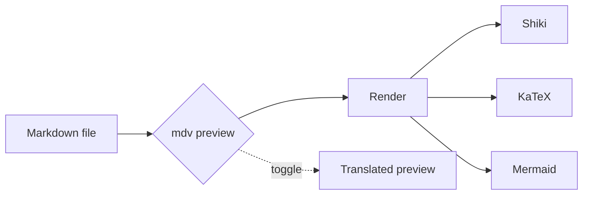
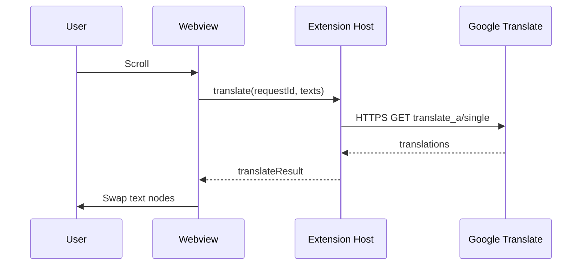

# mdv Feature Demo

This file exercises every feature mdv supports. Open it with **mdv Preview** to see it rendered.

## Text formatting

Regular text with **bold**, *italic*, ***bold italic***, ~~strikethrough~~, and ==highlight== marks. You can also write H~2~O and E = mc^2^ using subscript and superscript.

Soft line breaks
are preserved as written
(no need for trailing spaces).

> Block quotes work like you'd expect.
>
> — someone, somewhere

## Lists

### Unordered

- Apple
- Banana
  - Cavendish
  - Plantain
- Cherry

### Ordered

1. First
2. Second
3. Third

### Task list

- [x] Install mdv
- [x] Open this demo
- [ ] Ship something with it

### Definition list

Markdown
: A lightweight markup language for creating formatted text.

mdv
: A rich Markdown viewer for VS Code.

## Links

- External link: [Anthropic](https://www.anthropic.com)
- Wiki-link: [[demo]] (links back to this file)
- Wiki-link with alias: [[demo|the demo file]]
- Relative file link: [README](../README.md)

## Code

Inline `const answer = 42;` right in the middle of a sentence.

```typescript
// Shiki syntax highlighting (GitHub Light theme)
interface Greeter {
  greet(name: string): string;
}

class Friendly implements Greeter {
  greet(name: string) {
    return `Hello, ${name}!`;
  }
}

const g = new Friendly();
console.log(g.greet("world"));
```

```python
def fib(n: int) -> int:
    a, b = 0, 1
    for _ in range(n):
        a, b = b, a + b
    return a

print([fib(i) for i in range(10)])
```

```bash
# Shell scripts too
for f in *.md; do
  echo "Found: $f"
done
```

## Math

Inline math: the area of a circle is $A = \pi r^2$.

Block math:

$$
\int_{-\infty}^{\infty} e^{-x^2} \, dx = \sqrt{\pi}
$$

$$
\begin{pmatrix}
a & b \\
c & d
\end{pmatrix}
\begin{pmatrix}
x \\
y
\end{pmatrix}
=
\begin{pmatrix}
ax + by \\
cx + dy
\end{pmatrix}
$$

## Tables

| Feature              | Supported | Notes                             |
| -------------------- | :-------: | --------------------------------- |
| GFM tables           |     ✅    | Alignment works                   |
| Syntax highlighting  |     ✅    | Powered by Shiki                  |
| Math                 |     ✅    | KaTeX                             |
| Diagrams             |     ✅    | Mermaid                           |
| Wiki-links           |     ✅    | `[[page]]` style                  |
| On-demand translate  |     ✅    | Right-click → Toggle              |

## Inline SVG

You can drop raw SVG straight into Markdown:

<svg viewBox="0 0 200 120" xmlns="http://www.w3.org/2000/svg" width="200" height="120">
  <defs>
    <linearGradient id="g" x1="0" x2="1" y1="0" y2="1">
      <stop offset="0%" stop-color="#60a5fa"/>
      <stop offset="100%" stop-color="#a78bfa"/>
    </linearGradient>
  </defs>
  <rect x="4" y="4" width="192" height="112" rx="12" fill="url(#g)"/>
  <circle cx="60" cy="60" r="28" fill="#fff" opacity="0.85"/>
  <text x="100" y="66" font-family="sans-serif" font-size="20" fill="#fff" font-weight="700">mdv</text>
</svg>

Image-style SVGs work too:


## Mermaid diagrams





## Annotations

Try this:

1. Select any sentence above.
2. Right-click → **mdv: Add Comment**.
3. Open the **Annotations** panel (bottom panel, `mdv` tab).
4. Use the toolbar to copy all annotations, or clear them.

## Translation

Run **mdv: Toggle Google Translate** from the right-click menu. Blocks translate on demand as you scroll. Toggle again to restore the original text.

---

That's everything. Happy reading.
